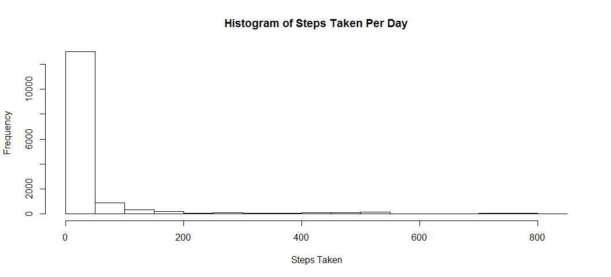
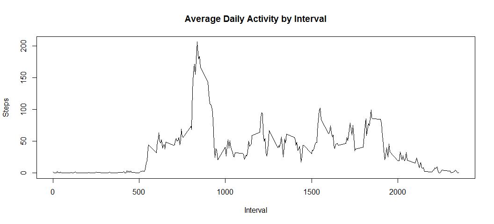
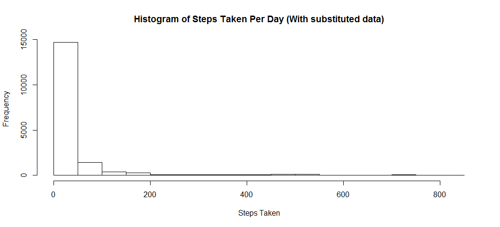
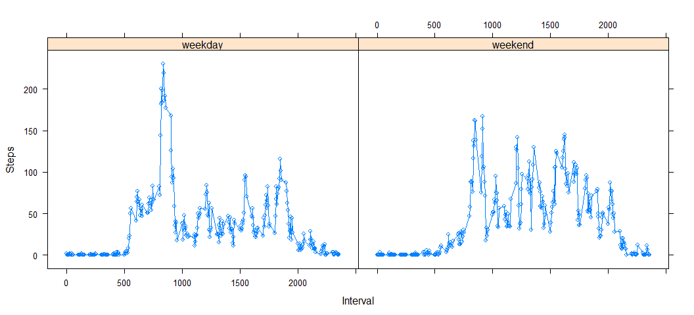

# Reproducible Research: Peer Assessment 1


## Loading and preprocessing the data

```r
unzip("activity.zip")
activities <- read.csv("activity.csv")
```
As demonstrated above, the data comes in an archived (zip) format.  Unziping the archive will provide us with a CSV file that can easily be read.

## What is mean total number of steps taken per day?

```r
#calculate means
stepmean <- mean(activities[complete.cases(activities),"steps"])
stepmedian <- median(activities[complete.cases(activities),"steps"])
#Plot the graph
hist(activities[complete.cases(activities),"steps"],main = "Histogram of Steps Taken Per Day",xlab="Steps Taken")
```

 

The mean steps taken per day is: **37.3825996**  
The median steps taken per day is: **0**

## What is the average daily activity pattern?

To begin, the mean steps taken per interval must be calculated.

```r
averaged <- as.data.frame(tapply(activities$steps,activities$interval,mean,na.rm=TRUE))
#Apply appropriate column names to the resulting data
names(averaged)[1] <- "average"
averaged$interval = rownames(averaged)
```

```r
plot(averaged$interval,averaged$average,type="l", main="Average Daily Activity by Interval",xlab="Interval",ylab="Steps")
```

 

```r
maxaverage <- averaged[which.max(averaged$average),]
```
The maximum average of **206.1698113** steps was taken at interval **835**

## Imputing missing values
Our provided dataset has **2304** missing values for `steps`

To address the missing values, the interval averages calculated above will be substituted in.

To substitute the missing values:  

1. Merge the `activies` and `averaged` datasets on the `interval` column.

2. Find all entries in the `steps` column with a value of `NA` and replace them with the rounded value from the (newly merged) `average` column

The code to accomplish this is:

```r
merged <- merge(x = activities, y = averaged, by = "interval", all = TRUE)
merged[is.na(merged[,"steps"]), "steps"] <- round(merged[is.na(merged[,"steps"]), "average"])
#fix the "average" column type
merged$average <- as.numeric(merged$average)
```

As shown below, the histogram of the new dataset is largely unchanged from its original

```r
#re-calculate means
stepmean2 <- mean(merged[,"steps"])
stepmedian2 <- median(merged[,"steps"])
#Plot the graph
hist(merged[complete.cases(merged),"steps"],main = "Histogram of Steps Taken Per Day (With substituted data)",xlab="Steps Taken")
```

 

With missing data substituted with the averages for their associated interval  
The mean steps taken per day is: **37.3806922** which represents a **0.0051**% change.  
The median steps taken per day is: **0** which represents a **0.0051**% change.


## Are there differences in activity patterns between weekdays and weekends?
Before ansewring this, a factor must be added to the dataset to determine if a date is a weekday or a weekend.

```r
daytype <- function(date) {
    if(weekdays(as.Date(date)) %in% c("Monday","Tuesday","Wednesday","Thursday","Friday")) {
        return("weekday")
    } 
    return("weekend")
}
#use lapply to apply the function to the list
merged$isweekday <- as.data.frame(do.call(rbind,lapply(merged[,"date"],daytype)))$V1
#summarize the data
library(dplyr)
```

```
## 
## Attaching package: 'dplyr'
## 
## The following object is masked from 'package:stats':
## 
##     filter
## 
## The following objects are masked from 'package:base':
## 
##     intersect, setdiff, setequal, union
```

```r
summarized <- merged %>% group_by(interval,isweekday) %>% summarise_each(funs(mean))
```

```r
library(lattice)
xyplot(steps ~ interval|isweekday,data=summarized,type='b',xlab ="Interval",ylab="Steps")
```

 
Whilte the subject is reasonably active both during the week and on the weekends, it appears that there is a greater amount of activity in the mornings on the weekdays vs the weekend. 
